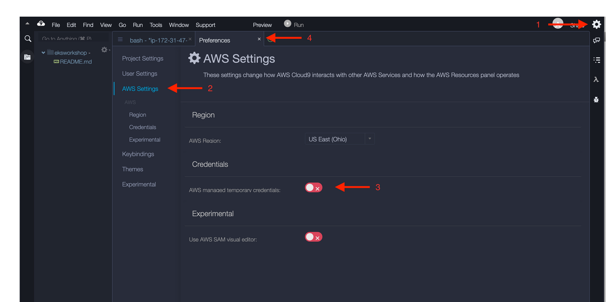
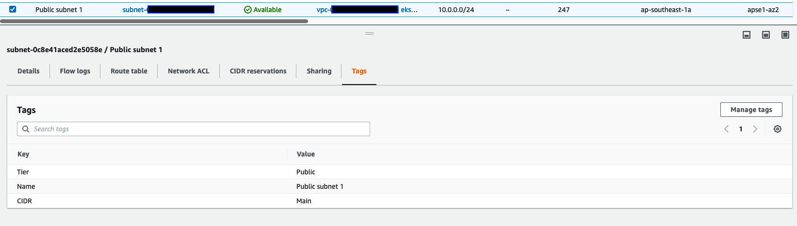

# EKS CNI Custom Networking Demo

## Disclaimer

> **This project is used for demo purposes only and should NOT be considered for production use.**

## Architecture Diagram


## Deployment

### Pre-requisites

1. Create Cloud9 environment with the following inputs
    - Environment type: `Create a new EC2 instance for environment (direct access)`
    - Instance type: `t2.micro`
    - Platform: `Amazon Linux 2`
    - Network settings: choose a public subnet in the primary CIDR range of the VPC where EKS cluster will be deployed

1. Cloud9 setup
    - Create IAM Role and attach it to Cloud9 instance
        - Create an IAM Role (e.g. `cloud9-ec2-role`) that can be assumed by EC2 and has `AdministratorAccess` IAM policy and `GCCIAccountPolicy` Permissions Boundary policy attached.
        - In the Cloud9 environment, click `Manage EC2 Instance` which will open up the EC2 console. Attach the created IAM role to the EC2 instance.
            
            
        - Return to the Cloud9 environment and click the gear icon (in top right corner). Select `AWS Settings` and turn off `AWS managed temporary credentials`.
            
        - Run `aws sts get-caller-identity` and ensure that the role being used is the newly created IAM Role.
    - Install tools
        ```bash
        # install kubectl and enable autocomplete
        sudo curl --silent --location -o /usr/local/bin/kubectl \
        https://amazon-eks.s3.us-west-2.amazonaws.com/1.19.6/2021-01-05/bin/linux/amd64/kubectl

        sudo chmod +x /usr/local/bin/kubectl

        kubectl completion bash >>  ~/.bash_completion
        . /etc/profile.d/bash_completion.sh
        . ~/.bash_completion

        # install useful yum packages
        sudo yum -y install jq gettext bash-completion moreutils

        # update AWS CLI
        curl "https://awscli.amazonaws.com/awscli-exe-linux-x86_64.zip" -o "awscliv2.zip"
        unzip awscliv2.zip
        sudo ./aws/install
        ```
    - Clone the Github repository
        ```bash
        # clone the repository
        git clone https://github.com/yuwindr/eks-cni-demo.git
        # enable scripts to be executed
        cd eks-cni-demo/
        chmod +x scripts/*.sh
        ```

1. Tag VPC subnets  
    - For subnets that we want to include in the EKS cluster, tag it with the following keys and appropriate values:
        - Tier: Private/Public
        - CIDR: Main/Secondary
        - *E.g. for public subnet in the main VPC CIDR range (10.0.0.0/16), it should have tags `Tier=Public` and `CIDR=Main`.*
        - *Note: this template expects 1 public and 1 private subnet in each of the two AZs: ap-southeast-1a and ap-southeast-1b in each CIDR (primary and secondary)*
        - e.g. Public subnet in primary CIDR:
        
        - e.g. Public subnet in secondary CIDR:
        
        
    - In the VPC that we want to deploy target EC2 instance into, tag the Public subnet in ap-southeast-1a AZ with the following keys and appropriate values:
        - Tier: Private/Public
        - *Note: this template expects 1 public subnet in ap-southeast-1a AZ*
        - 

1. Terraform setup
    - Create an S3 bucket to store Terraform state files. Go to [S3 console](https://s3.console.aws.amazon.com/s3/home?region=ap-southeast-1), click `Create bucket` with the following inputs
        - Bucket name (use your preferred bucket name): `eks-demo-tf-bucket-1234`
        - AWS region: `ap-southeast-1`
        - Optionally enable `Server-side encryption` with `Amazon S3 key (SSE-S3)`
        - Leave other options as default and click `Create bucket`
    - Create an EC2 Key Pair. This will be used to SSH into the EC2 instances during Verification step later. [Go to EC2 console > Key Pairs](https://ap-southeast-1.console.aws.amazon.com/ec2/v2/home?region=ap-southeast-1#KeyPairs) and click `Create key pair`
        - Name (use your preferred key pair name): `eks-demo-keypair`
        - Key pair type: `RSA`
        - Private key file format: `.pem` *(choose .ppk if you are planning to connect using Putty)*
        - Click `Create key pair`
    - Open main.tf and replace the `<bucket-name>` under `backend "s3"` with the bucket name created above. The Terraform state files will be stored there.
    - Fill in `terraform.tfvars` with the necessary values:
        - `iam_permissions_boundary_policy_arn`: ARN of the IAM Permissions Boundary policy that is needed to be attached when creating a role
            - To find the ARN, go to [IAM Console > Policies](https://console.aws.amazon.com/iamv2/home?region=ap-southeast-1#/policies), click on the policy and copy the `Policy ARN`
        - `eks_vpc_id`: VPC ID where EKS cluster will be deployed into
            - This VPC should have 2 CIDR ranges (1 primary and 1 secondary)
            - For both CIDRs, there should be 1 public subnet and 1 private subnet in each of these AZs: `ap-southeast-1a` and `ap-southeast-1b`
            - In total there should be 8 subnets (4 in primary CIDR, 4 in secondary CIDR)
        - `ec2_vpc_id`: VPC ID where target Docker EC2 instance will be launched into
            - This VPC should have 1 public subnet in AZ `ap-southeast-1a`
        - `eks_vpc_main_cidr`: primary CIDR range of the EKS VPC (e.g. `10.0.0.0/16`)
        - `eks_vpc_secondary_cidr`: secondary CIDR range of the EKS VPC (e.g. `100.64.0.0/16`)
        - `ec2_vpc_main_cidr`: primary CIDR range of the EC2 VPC (e.g. `10.0.0.0/16`)
        - `eks_cluster_name`: name of the EKS cluster
        - `key_pair_name`: name of the key pair created above
        - `ec2_ami_id`: AMI ID used for the EC2 instance. The default value is the Amazon Linux 2 AMI in ap-southeast-1 region.
        - `serviceA_container_image`: container image URI to be used to deploy Service A (refer to Architecture Diagram). The default value is the image on ECR that can be SSH-ed into.
        - `serviceB_container_image`: container image URI to be used to deploy Service B (refer to Architecture Diagram). The default value is the image on ECR that will return caller IP address when an HTTP call is made to it.


### Terraform deployment

```bash
    terraform init
    terraform plan
    terraform apply
```

## Verification Steps

### Check cluster details
- There will be 2 kubectl config contexts added - 1 for cluster 1 (CNI enabled) and 1 for cluster 2 (CNI disabled). The activated context is cluster 1. Run the following commands to get basic information:
    ```bash
    # you should see 2 nodes
    kubectl get nodes
    # you should see 8 pods, 4 for service A, 4 for service B
    # for cluster 1, the IP should be using the secondary CIDR, e.g. 100.x.x.x
    kubectl get pods -o wide
    # Take note of one of the Service A pods' IP address and one of the Service B pods' IP address
    ```
- Example screenshot:  
    

### SSH into Cluster 1 Service A pod and verify network configuration

```bash
# Skip this step if you are using Cloud9 environment.
# If you are not using Cloud9, you will need to first SSH into one of the EKS worker nodes' EC2 instance.
ssh -i <path to key pair> ec2-user@<Public IP address of EC2 instance>

# SSH into Service A, use demoPW839x as password
ssh userdemo@<private IP address of Cluster 1 Service A, should be 100.x IP>

# Scenario 1 - Make an HTTP Call to ifconfig.me - should return a public IP
curl ifconfig.me

# Scenario 2 - Make an HTTP Call to target EC2 - should return a 10.x IP
## private IP address is printed in Terraform outputs
curl <private IP address of EC2 instance>

# Scenario 3 - Make an HTTP Call to Cluster 1 Service B - should return a 100.x IP
curl <Cluster 1 Service B IP address, should be 100.x IP>

# Scenario 4 - Make an HTTP Call to Cluster 2 Service B - should return a 100.x IP
curl <Cluster 1 Service B IP address, should be 10.x IP>
```


## References
- Container images by @chariswn
- Starting Terraform files + Terraform modules from @ftseng
- Scripts to enable CNI and annotate nodes taken from [here](https://tf-eks-workshop.workshop.aws/500_eks-terraform-workshop/570_advanced-networking.html)